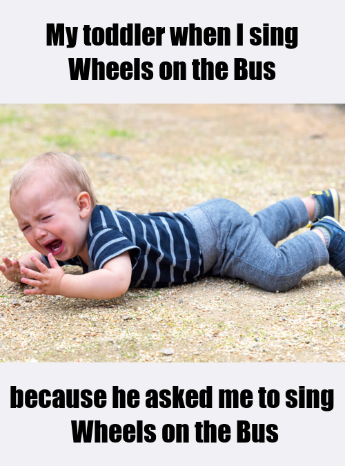

# Oh hi!

### My Meme

When we were asked to create an original meme, I knew mine would rotate around parenting and my life as a mom 👩‍🍼.
There are so many unforgettable moments 🏆, big emotions 😆 😠 😢 and parenting fails 💩 to choose from - how could I __NOT__ pay tribute to them at all? 
I just thought my parenting life would be an incredible source of ideas and inspiration (and hopefully a laugh or two) 😜.

My meme is a true original story of my DS (dear son for those unfamiliar with [Mommy message board lingo](https://monicaandandy.com/blogs/ma-edit/mom-terms-to-know)).

It's a reccuring story that happens when the planets don't align? Don't know. But I can assure you though that at times like these, he is not. such. a dear.
I found an image that perfectly portrays the deep frustration my DS experiences when this happens, and threw in one of the _MANY_ reasons for such frustration.

